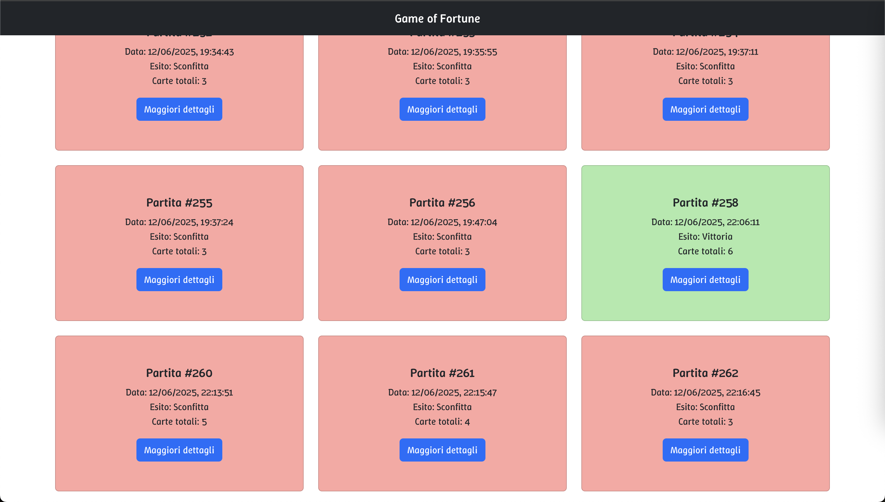

[](https://classroom.github.com/a/uNTgnFHD)

# Exam #1: "Gioco della Sfortuna"

## Student: s344986 BOCCADIFUOCO ALICE

## React Client Application Routes

- Route `/`: page content and purpose
- Route `/something/:param`: page content and purpose, param specification
- ...

## API Server

- POST `/api/something`

  - request parameters and request body content
  - response body content

  post`/api/user/`
  post `/api/card/`

  post `/api/game/`
  post `/api/initialCards/`
  post `/api/round/`

- GET `/api/something`

  - request parameters
  - response body content

  get `/api/user`
  get `/api/user/:username`

  get `/api/card`
  get `/api/card/:id`

  //prendiamo tutti i game associati a uno user
  get `/api/game/userId/:username`

//prendiamo le initial cards di uno specifico game
get `/api/InitialCards/:gameId`

//tutti i round di un game
get `/api/round/:gameId`
//tutti i round vinti di un game
get `/api/round/:gameId/won`

- POST `/api/something`
  - request parameters and request body content
  - response body content
- ...

## API Server Endpoints

### USER

- **POST** `/api/users` — Crea un nuovo utente
  - Body: `{ username, password }`
  - Response: `{ id }`
- **GET** `/api/users` — Lista tutti gli utenti
  - Response: `[ ...users ]`

### SESSION (AUTH)

- **POST** `/api/sessions/` — Login utente

  - Request body:
    ```json
    {
      "username": "username",
      "password": "password"
    }
    ```
  - Response Status: 201 Ok (login riuscito), 401 Not authorized (login fallito)

- **GET** `/api/sessions/current` — Info utente loggato

  - Response Status: 200 Ok, 401 Not authenticated
  - Response :
    ```json
    {
      "username": "username",
      "password": "password"
    }
    ```

- **DELETE** `/api/sessions/current` — Logout
  - Response Status: 200 Ok
  - Response: `_`

### CARDS

- **GET** `/api/cards` — Lista tutte le carte
  - Request body: none
  - Response Status: 200 Ok, 404 NotFound, 500 InternalServerError
  - Response:
    ```json
    [
      {
        "id": 1,
        "name": "Nome carta",
        "url": "images/cards/xxx.jpg",
        "misfortune_index": 42,
        "theme": "Tema"
      },
      ...
    ]
    ```
- **GET** `/api/cards/:id` — Dettaglio carta
  - Response Status: 200 Ok, 404 NotFound, 500 InternalServerError
  - Response:
    ```json
    {
      "id": 1,
      "name": "Nome carta",
      "url": "images/cards/xxx.jpg",
      "misfortune_index": 42,
      "theme": "Tema"
    }
    ```

### GAME

- **POST** `/api/games/start` — Avvia una nuova partita (ritorna carte iniziali e gameCards)
- Response Status: 201 Ok, 422 InvalidInput, 503 FailedToCreate
  - Body: `-`
  - Response: `{ gameId, initialCards[{id}], gameCards[{id, name, url, theme}] }`
- **GET** `/api/games/:username` — Tutte le partite di un utente (autenticato)
- Response Status: 201 Ok, 404 NotFound, 503 FailedToRetrieve

  - params: `username`
  - Body: `-`
  - Response: `[ { ...game, initialCards[{name}], rounds[{won, roundNumber, cardName}] } ]`

- **PATCH** `/api/games/:gameId` — Aggiorna esito partita
- Response Status: 200 Ok, 503 FailedToUpdate
  - params: `gameId`
  - Body: `{ outcome, totalCards }`
  - Response: `-`
- **DELETE** `/api/games/:gameId` — Elimina una partita
- Response Status: 204 Ok, 503 FailedToDelete
  - params: `gameId`
  - Body: `-`
  - Response: `-`

### INITIAL CARDS

- **POST** `/api/initial-cards/` — Salva carte iniziali (solo loggati)
- Response Status: 201 Ok, 422 InvalidInput, 503 FailedToCreate
  - Body: `{ gameId, cardIds }`
  - Response: `-`

### ROUNDS

- **POST** `/api/rounds/` — Crea un round
  - Response Status: 201 Ok, 422 InvalidInput, 503 FailedToCreate
  - Body: `{ gameId, cardId, won, roundNumber }`
  - Response: `{ id }`
- **GET** `/api/rounds/:gameId` — Tutti i round di una partita (autenticato)
- Response Status: 201 Ok, 422 InvalidInput, 503 FailedToCreate
- params: `{ gameId}`
- Response: `[ ...rounds ]`
- **PATCH** `/api/rounds/:roundId` — Aggiorna round con esito
- Response Status: 200 Ok, 404 NotFound, 503 FailedToUpdate
  - params: `roundId`
  - Body: `{ leftMisfortune, rightMisfortune, cardId, timeStamp }`
  - Response: `{ misfortuneIndex, won }`

## Database Tables

- **User**

  - `id` (INTEGER, PRIMARY KEY)
  - `username` (TEXT, UNIQUE, NOT NULL)
  - `password` (TEXT, NOT NULL)
  - `salt` (TEXT, NOT NULL)

- **Card**

  - `id` (INTEGER, PRIMARY KEY)
  - `name` (TEXT, UNIQUE, NOT NULL)
  - `url` (TEXT, NOT NULL)
  - `misfortune_index` (NUMERIC, UNIQUE, NOT NULL)
  - `theme` (TEXT)

- **Game**

  - `id` (INTEGER, PRIMARY KEY)
  - `createdAt` (TEXT, NOT NULL)
  - `userId` (INTEGER, FOREIGN KEY User(id) ON DELETE CASCADE)
  - `totalCards` (INTEGER)
  - `outcome` (INTEGER)

- **InitialCards**

  - `id` (INTEGER, PRIMARY KEY)
  - `gameId` (INTEGER, FOREIGN KEY Game(id) ON DELETE CASCADE)
  - `cardId` (INTEGER, FOREIGN KEY Card(id) ON DELETE CASCADE)

- **Round**
  - `id` (INTEGER, PRIMARY KEY)
  - `gameId` (INTEGER, FOREIGN KEY Game(id))
  - `cardId` (INTEGER, FOREIGN KEY Card(id))
  - `won` (INTEGER, NOT NULL)
  - `roundNumber` (INTEGER, NOT NULL)
  - `timeStamp` (INTEGER, NOT NULL DEAFULT 0)

## Main React Components

- `ListOfSomething` (in `List.js`): component purpose and main functionality
- `GreatButton` (in `GreatButton.js`): component purpose and main functionality
- ...

(only _main_ components, minor ones may be skipped)

## Screenshot



## Users Credentials

- username, password (plus any other requested info)
- username, password (plus any other requested info)
